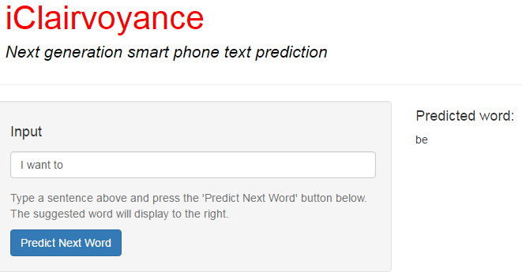

# iClairvoyance — next-word prediction in R

A small predictive-text app: type a phrase, get the most likely next word.
Built in 2016 as the capstone project for the Johns Hopkins Data Science
Specialization on Coursera, using the SwiftKey English corpus (blogs, news and
tweets).

> Shared as a record of the work, not as a reference solution — if you're
> taking the course, please do your own.

## How it works

1. **Sample and clean.** `CreateNgrams.R` draws 15,000 lines at random from
   each of the three sources (45,000 in total), then strips whitespace,
   punctuation, numbers and non-ASCII characters and lowercases everything.
2. **Build n-gram tables.** RWeka's tokenizer turns the sample into 2-, 3- and
   4-grams. Each table is counted, filtered to n-grams seen at least twice,
   sorted by frequency and saved to `ngrams.RData`, small enough to load
   quickly on app start-up.
3. **Predict with back-off.** `ShinyApp/PredictShiny.R` looks up the most
   frequent n-gram that starts with the words you've typed and returns its
   last word, falling back to a shorter history when there's no match. It's a
   frequency back-off (closest to "stupid back-off"), not a smoothed
   probability model.

## Repository

| Path | What it is |
|---|---|
| `Milestone_Report.Rmd`, `Milestone*.R` | Exploratory analysis of the corpus: sizes, word frequencies, first plans |
| `CreateNgrams.R` | Builds `ngrams.RData` from the raw corpus |
| `ShinyApp/` | The app: `ui.R`, `server.R`, and the predictor in `PredictShiny.R` |
| `Final_Pitch.Rpres` | The five-slide pitch deck |

## Running it

The app needs `ngrams.RData` next to `server.R`, which isn't in the current
tree. Either rebuild it:

1. Download and unzip the Coursera-SwiftKey dataset (the original link is in
   the comment at the top of `CreateNgrams.R` and may no longer work).
2. Change the `setwd(...)` line to your own folder, and add `library(dplyr)`,
   which the script's `filter()` calls need.
3. Run `CreateNgrams.R`, then copy `ngrams.RData` into `ShinyApp/`.

Then, in R: `install.packages(c("shiny", "stringi"))` and
`shiny::runApp("ShinyApp")`.

## Known limitations

Looking back at it now:

- **The 4-gram table is never used.** `predictNextWord` keeps only the last
  two words of the input, so it tries trigrams, then bigrams, and the 4-gram
  branch never runs.
- **Lookup is a linear scan** with a regex per row. That's fine for a small
  table, but slow as the tables grow; a hash keyed on the history would be
  constant-time.
- **No smoothing.** Kneser-Ney or Good-Turing would give better predictions
  for rare histories than raw frequency.
- **The sample is small.** 45,000 lines, a small fraction of the full
  corpus, chosen to keep the app fast on the free Shiny tier.

## Built with

R, [tm](https://cran.r-project.org/package=tm),
[RWeka](https://cran.r-project.org/package=RWeka),
[stringi](https://cran.r-project.org/package=stringi),
[quanteda](https://cran.r-project.org/package=quanteda) and ggplot2 for the
exploration, and [Shiny](https://shiny.posit.co/) for the app.
